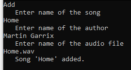
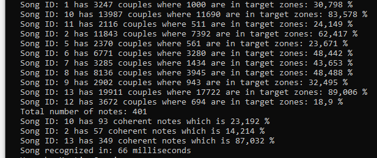
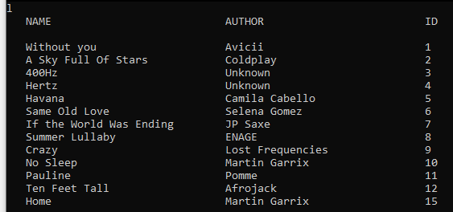
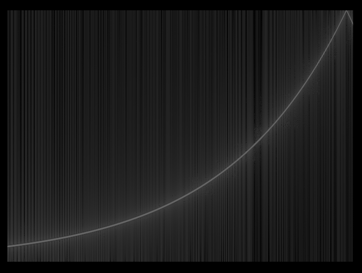

# Shazam

### Content

- Overview
- Installation
- Shazam guide
- Visualizer guide

## Overview

This application is a 'cheap' replica of [Shazam](https://www.shazam.com/). Essentially if you play it a song, it tells you what song it is and who made it.* The song recognition is however implemented with an algorithm that searches very fast. The essence is looking for shared position of multiple important notes rather than comparing recording with each song at every possible point of time.

> Best audio volume for recording is when around 500 notes are gathered (can be displayed with debug mode see Shazam guide)

*If you are lucky enough and the song is in the database.

> On second branch called 'Datasets' I added over 12 hours of fingerprinted music. All songs can be found here on youtube [link](https://www.youtube.com/playlist?list=PLH2Yh8I6hScd7gJ8Xb6YwkNphSWF-k-T3).
>
> Any song from that playlist should be recognised with given fingerprints.

## Installation

**Requirements for song recognition**

- Device that is able to record audio (mono at 12 kHz sampling rate).

**Requirements for adding song to the database**

- Audio file in *.wav* format with sampling rate of 48 kHz

**Steps**

1. Compile project so necessary packages download (**SFML** library)
2. Run the application

## Shazam guide

Application is controled via CLI with simple commands.

| Command | Description                    						|
| ------- | ----------------------------------------------------|
| a, add  | Add a new song to the database 						|
| d,debug | Write additional information during song searching	|
| c, clear| Clear the console									|
| h, help | List all available commands							|
| l, list | List all songs in the database	|
| q, quit | Quit the application 								|
|r, record| Start audio recording and song recognition 			|

#### a, add

User is asked to enter *name* of the song, *author* of the song and name of the audio file (with *.wav*).

Then the audio file is processed and added to the database.

#### d, debug

Makes the song recognition write additional information about the matched songs in the database.

Information such as how many important notes share or how many of those notes are time coherent with the recording. 

> Note: percentage on time coherent notes can exceed 100% because of repeating parts in the song such as refrains.

#### c, clear

Simply clears the console.

#### h, help

Prints all available comands and their description. Similarly to the table above.

#### l, list

Lists all songs in the database.

#### q, quit

Quits the application

#### r, record

Initiates recording through microphone and then song recognition.

## Visualiser guide

As a part of this project I have built simple audio visualiser with three different modes. The original purpose of those visualisers was to help me debug audio and algorithms that were applied to audio data. Such as downsampling, FFT, stereo to mono conversions. Another way cooler audio visualiser that I wrote in C++ can be found here [github](https://github.com/JanKleprlik/AudioVisualiser).

### Code Example

First we get audio format that we convert from stereo to mono. We do that because Visualiser expects only one channel. Then we create Visualiser instance with data from the audio and specific Visualisation mode.

~~~c#
var audio = AudioReader.GetSound("Songs/WithoutYou.wav");
if (audio.Channels == 2)
    AudioProcessor.StereoToMono(audio);
var window = new Visualizer(audio.Data, audio.Channels, audio.SampleRate, VisualisationModes.Frequencies);
window.Run();
~~~

### Controls

- ESC - quits visualiser
- ENTER - shows next frame at spectogram mode

#### Amplitude mode

This mode visualises raw audio data as they are stored in audio file.

#### Frequency mode

Frequency mode visualises currently played frequencies. Best seen at simple sine wave with frequency from 20Hz to 20 kHz. 

#### Spectogram mode

Spectogram is a table where:

- *x* axis is time
- *y* axis is frequency
- Intensity of a point is its amplitude

> Sine wave rising from 50 Hz to 6 kHZ and then bouncing back down in a manner of 60 seconds

